# CantinaShop


---

## Introduction

**CantinaShop** is a comprehensive online store developed as the final project for the Python Web 2025 course at SoftUni. It offers a wide range of accessories and focuses on delivering a seamless and user-friendly shopping experience.

This project showcases the application of modern web development techniques and best practices in Python, including:

- Real-time communication using **WebSockets** for live chat between staff and customers  
- Responsive and modular design with **Tailwind CSS**  
- A hybrid **REST/MVC** architecture  
- Use of **Django Template Language (DTL)**  
- Implementation of **asynchronous programming** patterns  
- Extensive **automated testing** (unit and integration tests)  
- Production-ready **deployment**  
- Client-side interactivity through **AJAX** and **fetch API**  

The platform supports essential e-commerce features such as product management, shopping cart functionality, and user registration, making it a fully functional and practical application.

Additionally, CantinaShop is built to be fully responsive, delivering a seamless and consistent user experience across desktops, tablets, and mobile devices.
---

## Important Notes

This project **cannot be run immediately after cloning** due to dependencies on external API services like **Cloudinary** for image storage and processing. To run the project locally, you must set up the necessary environment variables with valid API credentials.

### Required Environment Variables (examples):

- `SECRET_KEY` — Django secret key  
- `CLOUDINARY_CLOUD_NAME`  
- `CLOUDINARY_API_KEY`  
- `CLOUDINARY_API_SECRET`  
- Email service provider credentials and PostgreSQL database configurations  

These variables can be loaded via a `.env` file or system environment using the `python-dotenv` library.

### Online Demo

A live demo of the project is available [here](#) *(link to be provided)*

---

## Technology Stack

- Python 3.11 + Django Framework  
- Django Channels & Daphne for asynchronous support  
- Tailwind CSS for styling  
- PostgreSQL as the primary database  
- Cloudinary for image hosting and management  
- WebSockets for real-time features  
- Django REST Framework  
- Django Template Language (DTL) for rendering views  
- Celery for asynchronous task processing  
- Django ORM for database interactions  

---

## Authentication and Account Management

The authentication system in **CantinaShop** is robust and secure, featuring:

- User registration with email confirmation  
- Login and logout functionality  
- Profile editing and account management  
- Email verification using secure tokens  
- Storage of user information and multiple addresses linked to the account  

---

### Registration and Email Confirmation Workflow

1. User submits registration data via `RegistrationForm` which validates the input.  
2. A new user record (`UserModel`) is created with `is_active = False`.  
3. An email with a verification link is sent using `EmailService.send_confirmation_email`.  
4. The verification link contains an encoded user ID (`uidb64`) and a secure token.

#### Example of a verification URL:
```
/activate/NjEyMw/token123/
```

---

### Account Activation Process

When the user clicks the activation link:

1. The `ActivateAccount` view decodes `uidb64` to retrieve the user.  
2. The token is validated with Django’s `default_token_generator`.  
3. Upon successful validation:  
   - The user's account is activated (`is_active = True`).  
   - The user is logged in automatically.  
4. The user is redirected to either an activation success page or an invalid token page.  

---

### Login and Logout

- Login is handled by Django's standard `LoginView`, supporting username/email and password.  
- Logout uses `LogoutView`, redirecting users to the homepage.  
- Logged-in users are prevented from accessing the login page through a custom `ProfileProhibitedMixin`.  

---

### User Profile and Account Management

Authenticated users can manage their personal data and addresses via the `AccountUpdateView`, which allows:

- Updating personal information (name, phone number, profile photo)  
- Adding, editing, and viewing addresses  
- Managing account settings  

Addresses are stored in the `Address` model and linked to the `Account` model, which is in a one-to-one relation with `UserModel`.

---

### Image Storage and Handling
The project uses Cloudinary for secure image storage and management. User profile pictures uploaded via forms utilize Django’s forms.ImageField(), which restricts uploads to image files only, preventing unsupported or potentially harmful file types. When a user updates their profile picture, the application uploads the new image to Cloudinary and automatically deletes the old image to avoid orphaned files and optimize storage. This ensures efficient media management and maintains data integrity.


### Account Deactivation

- Users can deactivate their accounts using `AccountDeactivateView`.  
- This action sets `is_active = False`, effectively disabling the account and logging the user out.  
- User data is preserved in the database for potential reactivation or administrative review.  

---

### User Roles and Permissions

The platform distinguishes two main user groups to manage permissions:

- **Superusers**: Full access with unrestricted CRUD permissions across the entire system.  
- **Administrators**: Limited administrative rights with certain restrictions compared to superusers.

This role-based access control ensures appropriate separation of duties and enhances security.

---

## Data Models Overview

| Model        | Description                                                  |
|--------------|--------------------------------------------------------------|
| `UserModel`  | Custom user model extending `AbstractUser`; includes unique email and chat ban status |
| `Account`    | One-to-one relationship with `UserModel`; holds personal details and main address |
| `Address`    | Stores multiple user addresses linked to an `Account`       |

---

## URL Endpoints

| Path                         | Description                     |
|------------------------------|--------------------------------|
| `/register/`                 | User registration              |
| `/login/`                   | User login                    |
| `/logout/`                  | User logout                   |
| `/activate/<uidb64>/<token>/` | Email account activation       |
| `/email-confirmation-sent/` | Notification after registration|
| `/activation-success/`      | Account activation success     |
| `/activation-invalid/`      | Invalid or expired activation  |
| `/`                         | User profile view and edit    |
| `/deactivate/`              | Account deactivation           |

---

## Security Measures

- All sensitive operations require authentication.  
- Email confirmation is mandatory for account activation.  
- Custom validators ensure usernames and addresses do not contain profanity (`NoProfanityValidator`).  
- Phone numbers are validated with a custom phone validator to ensure correct format.

---
### Screenshots
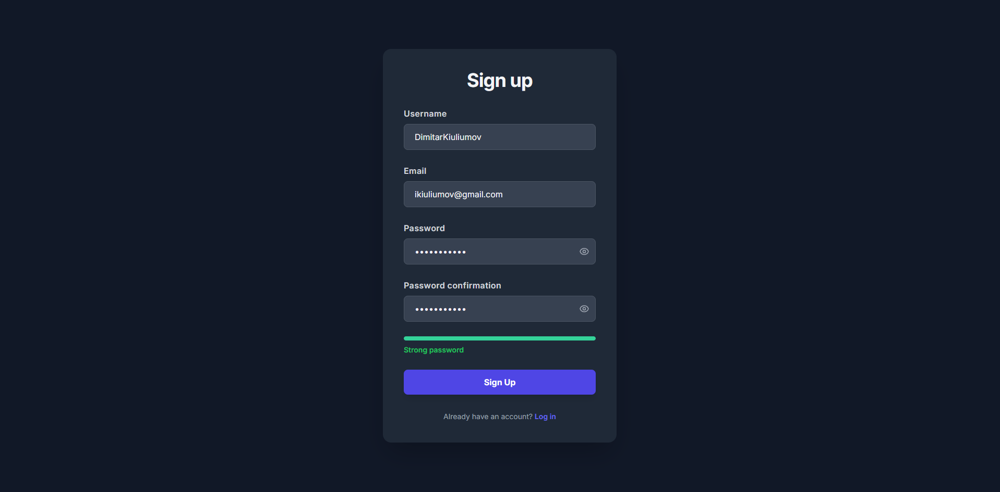
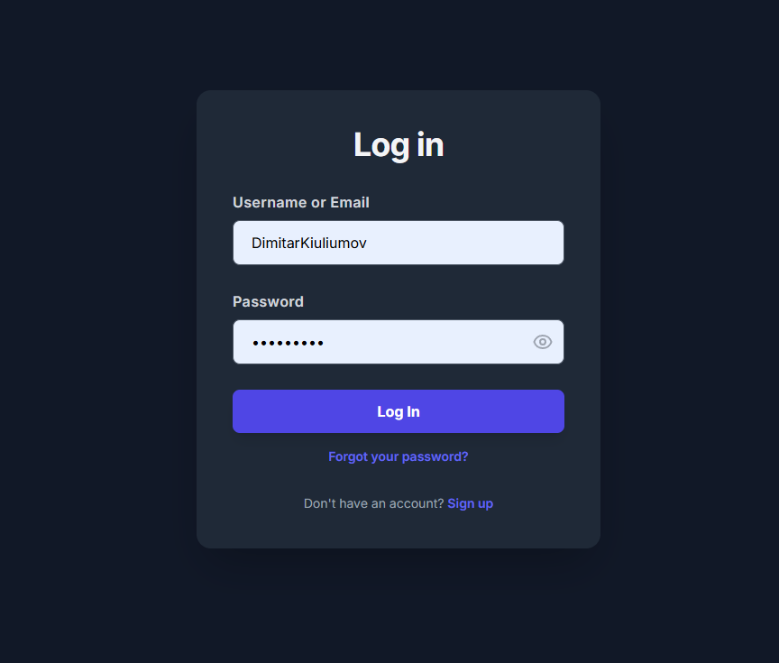
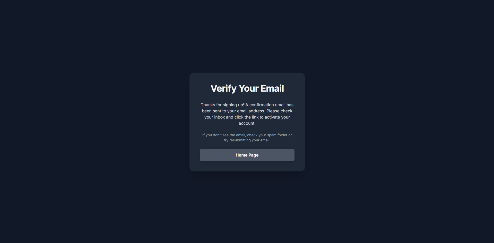
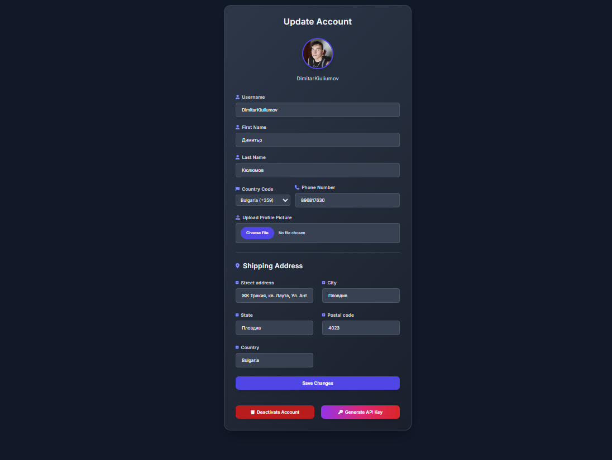
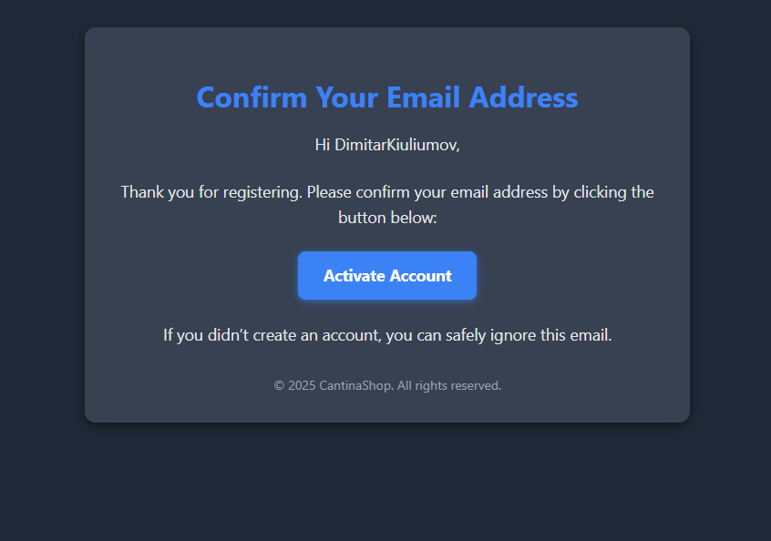


## Real-Time Chat System
CantinaShop includes a robust real-time messaging system that enables live communication between individual users and the entire administrative team. This group-based support model ensures that any available admin can assist users without delay.

### System Architecture

The chat system is built using:

- **Django Channels:** Manages WebSocket connections and message routing.
- **WebSocket Consumers:** Separate consumer classes handle admin and user interactions.
- **REST API:** Provides recent message history per user.
- **JavaScript Front-End:** Powers the chat interface with user-friendly, asynchronous updates.

### Communication Model

- Each **user** initiates a chat session with the **admin team**, not with a specific admin.
- All admins connected to the dashboard can see and respond to user messages in real time.
- Messages are synced across all active admin sessions, ensuring no support gaps.

### Workflow Overview

**1. Admin Dashboard Initialization**  
Admins are presented with a searchable list of users. No chat is active until a user is selected.

**2. Selecting a User**  
When an admin selects a user:
- The most recent 100 messages are retrieved via API.
- A WebSocket connection is established for that user-admin group thread.
- The chat input is enabled.

**3. Real-Time Messaging**  
All admins share the same conversation view for a user. Any admin can send a message, and all others (including the user) see it live. Message metadata includes:
- Sender identity
- Avatar and timestamp
- Role-based bubble styling

A de-duplication system prevents message duplication on re-renders or reconnections.

**4. WebSocket Management**  
A WebSocket session is tied to each user being viewed. Switching users closes the previous socket and opens a new one. Input fields are disabled if the socket disconnects.

**5. Spam Protection**  
To prevent abuse:
- Users are rate-limited (e.g. 60 messages/minute).
- Violators are flagged as banned and forcibly disconnected.
- Banned users cannot re-initiate chats until unbanned by staff.

### Configuration

The JavaScript client supports dynamic configuration through a global object (`window.chatConfig`). Key parameters include:

- `adminAvatarUrl` – Avatar for admin messages
- `defaultAvatarUrl` – Fallback avatar
- `messagesApiUrlBase` – Endpoint for fetching message history
- `websocketBaseUrl` – Auto-detected `ws://` or `wss://` connection string

### Summary

This real-time support system allows the entire admin team to collaborate in assisting individual users. It supports message persistence, secure WebSocket channels, shared visibility across admins, and spam control—making it a scalable and effective solution for customer communication.

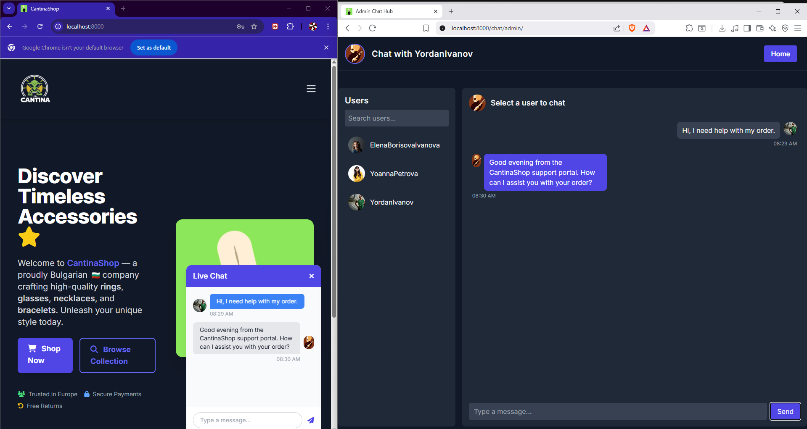


## Product Management and Processing

CantinaShop features a well-structured backend system for managing product data, customer feedback, and category organization. The system is designed with scalability and maintainability in mind, using Django's model architecture.

### Category Model

Products are organized into categories, each represented by a unique name. Category names are automatically filtered using a profanity-checking utility to ensure appropriate content.

### Product Model

The Product model supports a wide range of attributes and features, including:

- Unique name and description fields, both sanitized for inappropriate content using a profanity filter
- SEO-friendly `slug` field automatically generated and made unique
- Optional image URL (typically hosted via Cloudinary)
- Availability status and discount flag
- Price represented as a decimal with two decimal places
- Timestamps for creation and updates
- Foreign key relationship to a Category

#### Custom Logic

- **Profanity Filtering:** Both the name and description fields are automatically cleaned on save.
- **Slug Generation:** On initial creation, a unique slug is generated. If a conflict occurs, an incremental suffix is added until uniqueness is ensured.
- **Rating Properties:** Products expose computed properties for average rating and rating count, derived from the related Rating model.

### Rating Model

The Rating model allows users to provide a score (1–5) for a given product. Features include:

- Foreign key relationship to both the user (Account) and the product
- Server-side validation using Django’s `MaxValueValidator`

### Comment Model

Users can submit textual comments on products. The model includes:

- Foreign key relationships to both the product and the user (Account)
- Profanity filtering for the comment content
- Creation timestamp for chronological display


# Product App URL Routing

The product app provides the following URL endpoints for managing products, comments, ratings, and categories within CantinaShop:

| Path                            | HTTP Method | Description                                | View Class                  | URL Name           |
|--------------------------------|-------------|--------------------------------------------|-----------------------------|--------------------|
| `/`                            | GET         | List all products                          | `ProductListView`           | `product-list`      |
| `/new/`                        | GET, POST   | Add a new product                          | `AddProductView`            | `product-add`       |
| `/details/<slug:slug>/`        | GET         | View details of a product                  | `ProductDetailView`         | `product-details`   |
| `/delete/<slug:slug>/`         | POST, DELETE| Delete a product                           | `ProductDeleteView`         | `product-delete`    |
| `/edit/<slug:slug>/`           | GET, POST   | Edit/update a product                      | `ProductUpdateView`         | `product-edit`      |
| `/comments/<int:pk>/delete/`   | POST, DELETE| Delete a comment on a product              | `CommentDeleteView`         | `comment-delete`    |
| `/comments/<int:pk>/edit/`     | GET, POST   | Edit/update a comment                      | `CommentUpdateView`         | `comment-edit`      |
| `/rate/<slug:slug>`            | POST        | Set or update rating for a product        | `SetRatingView`             | `rate`              |
| `/cart/`                      | GET, POST   | View and manage the shopping cart         | `CartView`                   | `cart`              |
| `/category/create/`            | GET, POST   | Create a new product category              | `CreateCategory`            | `category-create`   |

### Notes:

- All views are class-based views imported from the `products.views` module.
- Slugs are used as unique identifiers for product detail, edit, delete, and rating URLs.
- Comment URLs use integer primary keys to uniquely identify comments for editing or deletion.
- The cart view allows users to manage items they intend to purchase.
- The category creation endpoint is for adding new product categories to the system.

## Product Browsing and Searching
- Browse through a comprehensive list of products, displayed in a paginated format for easy navigation.
- Search products by name or description to quickly find what you need.
- Filter products by category, availability status (available/unavailable), and sort by name or price in ascending or descending order.
- View detailed information about each product, including images, descriptions, pricing, and user reviews.
---

## Product Reviews and Ratings

- View customer comments and reviews on each product, with the most recent feedback shown first.
- Submit your own comments and feedback when logged in, contributing to the community’s product discussions.
- Edit or delete your own comments, ensuring you can manage your feedback at any time.
- Rate products on a scale from 1 to 5 stars, with average ratings displayed to help guide purchasing decisions.

---

## Product Management (Admin Only)

- Add new products to the store, specifying details such as name, description, price, category, and availability.
- Update existing product information to keep listings accurate and up to date.
- Remove outdated or discontinued products from the catalog.

---

## Shopping Cart

- Add products to a shopping cart that persists through browser sessions using cookies.
- View the shopping cart at any time, showing selected items, quantities, individual subtotals, and total order value.
- Modify the cart contents before proceeding to checkout (checkout functionality not included here).
- Uses cookies to save data

---

## Category Management

- Create new product categories to organize and classify items in the store (admin access required).
- Filter and browse products by category to streamline product discovery.

---

## Access and Security

- User authentication ensures that only registered users can comment, rate products, or manage their own reviews.
- Administrative controls restrict product and category management to authorized personnel only.
- Users can only edit or delete their own comments, maintaining privacy and content integrity.

---

### Screenshots
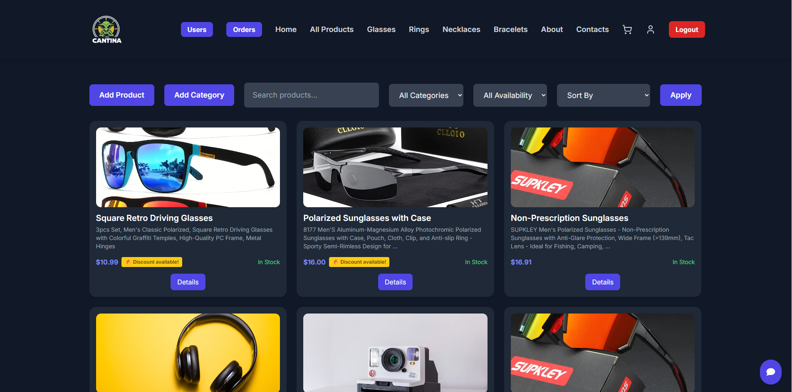
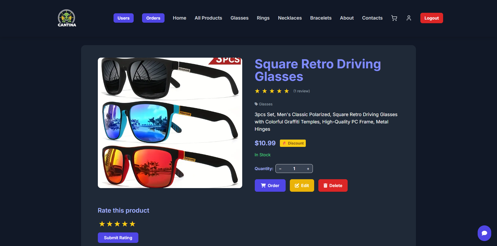
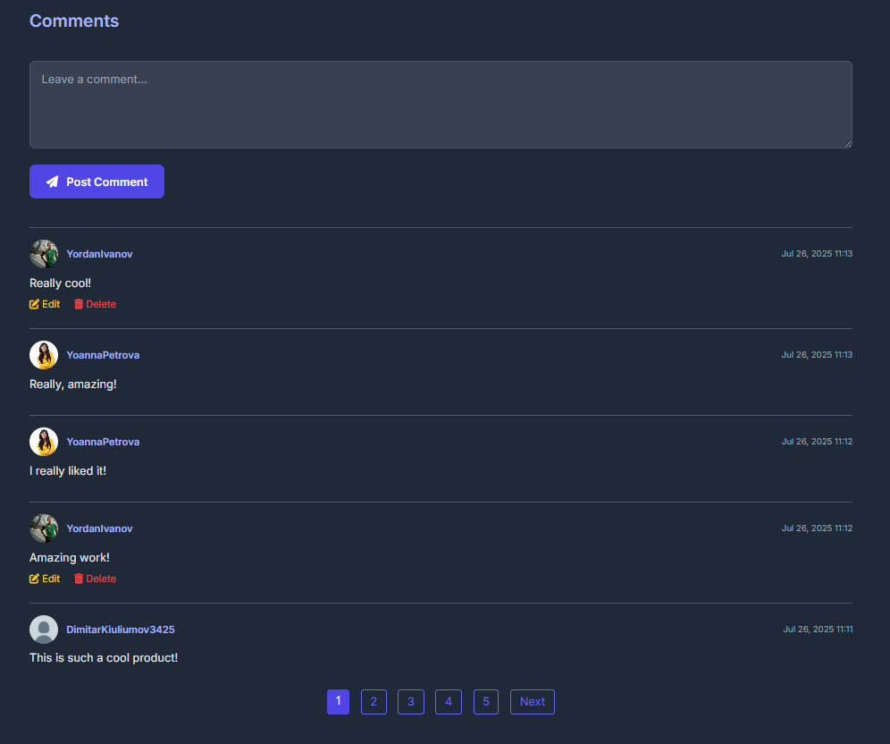


## Shopping Cart and Order Processing

CantinaShop includes a lightweight, cookie-based shopping cart and a secure, authenticated order processing system.

### Cart Functionality

- **Client-Side Cart:** Items are stored in a JSON-encoded cookie (`cart`), with a 7-day lifetime. No login is required.
- **Add to Cart:** `AddToCartView` parses product slug and quantity, merges duplicates, and updates the cookie.
- **Persistent Across Sessions:** Uses `samesite='Lax'` to maintain cart state securely.

### Checkout Flow

- **Restricted Access:** Only authenticated users with a completed `Account` and valid shipping address may proceed.
- **Validation:** Missing personal or address details prompt redirection to the profile page.
- **Cart Validation:** Users are redirected if the cart is empty or malformed.

### Order Submission

Orders are created via a POST to `/checkout/place-order/`. The process includes:

- **Validation:** Verifies cart data, user account, and selected payment option.
- **Data Extraction:** Parses products from cookie, calculates total price, and compiles order details.
- **Order Creation:** Saves the order via the `Order` model with status set to `pending`.
- **Asynchronous Email Confirmation:** An order confirmation email is dispatched in the background using a Celery task via `EmailService.send_order_confirmation_email()`.
- **Cart Cleanup:** The cart cookie is removed after successful order placement.

### Order Model

| Field            | Type          | Description                              |
|------------------|---------------|------------------------------------------|
| `account`        | FK to `Account` | Owner of the order                      |
| `payment_option` | CharField     | Selected payment method                  |
| `order_data`     | JSONField     | Serialized cart content                  |
| `total_price`    | DecimalField  | Final calculated amount                  |
| `status`         | ChoiceField   | Defaults to `'pending'`                  |
| `created_at`     | DateTimeField | Timestamp of order creation              |

### URL Endpoints

| Path                         | Method | Description                         |
|------------------------------|--------|-------------------------------------|
| `/add-to-cart/<slug>/`       | GET    | Add a product to the cart           |
| `/checkout/`                 | GET    | View checkout page                  |
| `/checkout/place-order/`     | POST   | Finalize order and trigger email    |

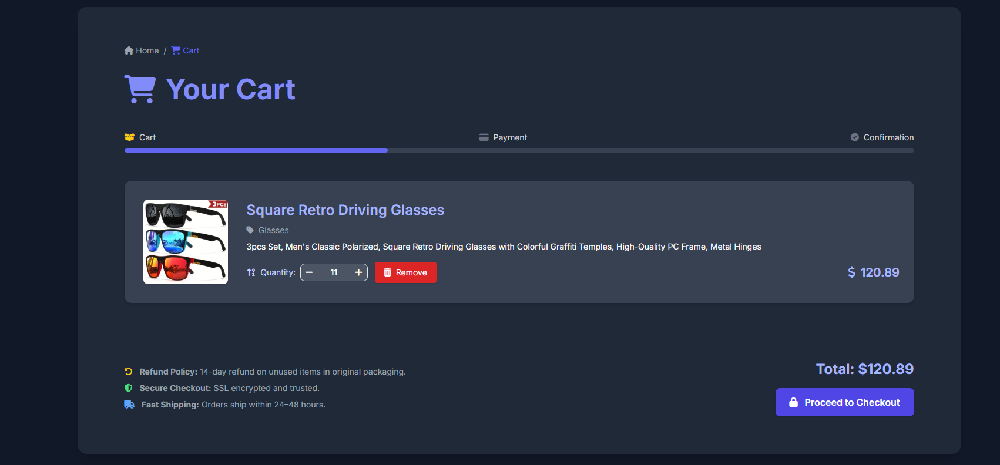
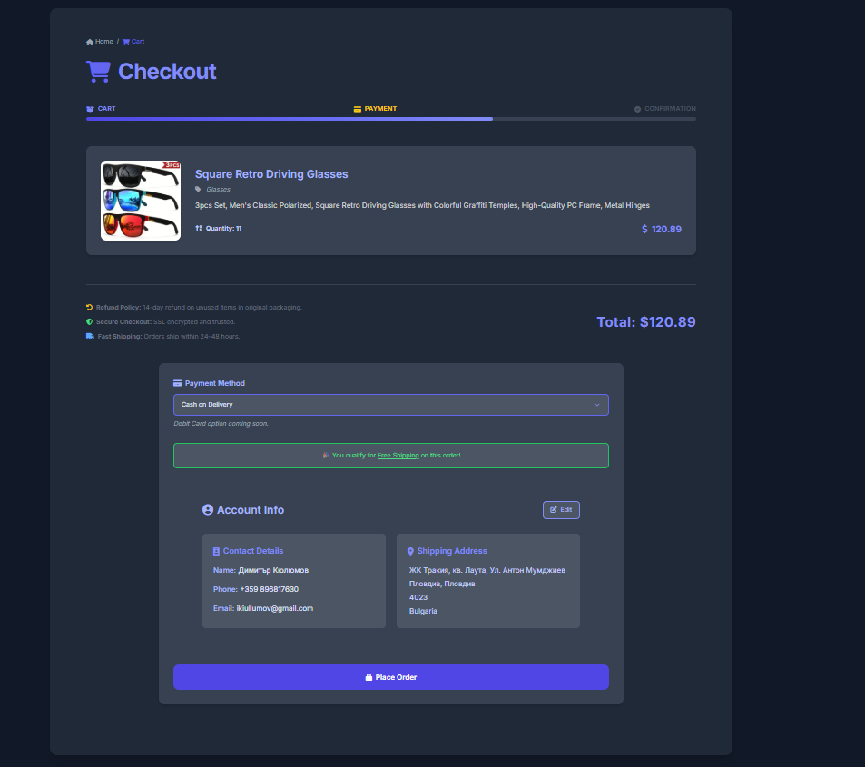
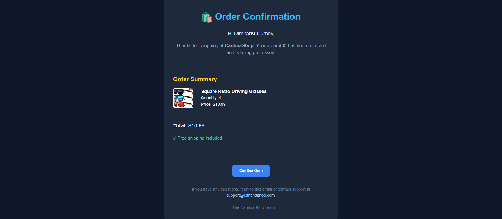
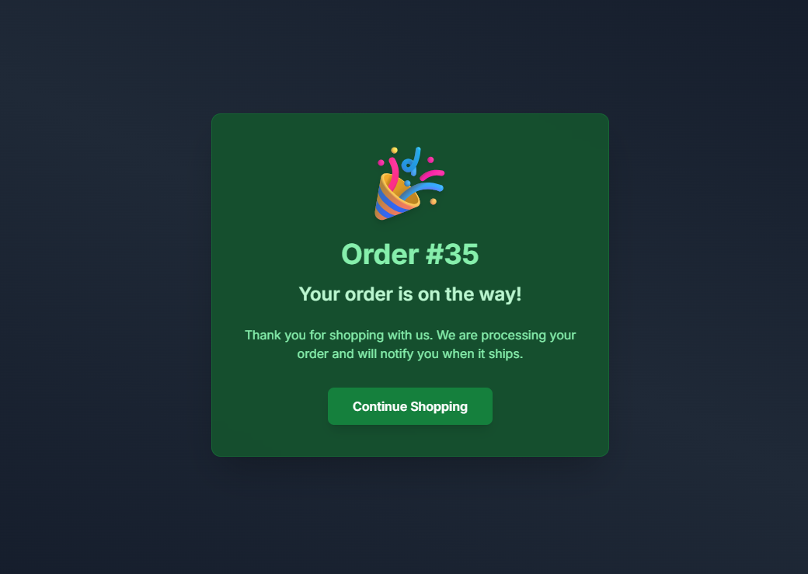


## Public API & Admin Endpoints

CantinaShop exposes a secure REST API with read-only access for general users and administrative control via API keys. All endpoints support API key and session-based authentication.
The API is used not only for internal rest components, but also for integrating the shop in other apps such as mobile apps, discrod bots, reddit bots and etc...
---

### API Schema & Documentation

| Path             | Description                             |
|------------------|-----------------------------------------|
| `/api/schema/`   | OpenAPI schema (JSON)                   |
| `/api/docs/`     | Swagger UI                              |
| `/api/redoc/`    | ReDoc documentation                     |

---

## Authentication: API Key

The platform supports stateless authentication via API keys:

- **Header Format:** `Authorization: Api-Key <your-api-key>`
- **Validation:** Keys must be active and not expired.
- **Restrictions:** Keys are tied to admin users; general users are not allowed to create or use them.


If the key is invalid, expired, or belongs to an inactive user, the request is rejected.

---

## Endpoints Overview

### Generate API Key

| Path               | Method | Access    | Description                            |
|--------------------|--------|-----------|----------------------------------------|
| `/api/generate_key`| POST   | Admin     | Generates a new API key (1/day/user)   |

---

### Products

| Path                  | Method | Access               | Description                            |
|-----------------------|--------|----------------------|----------------------------------------|
| `/api/products/`      | GET    | Public               | List products with advanced filtering  |
| `/api/products/`      | POST   | Admin                | Create a new product                   |
| `/api/products/<id>/` | GET    | Admin                | Retrieve a single product              |
| `/api/products/<id>/` | PUT    | Admin                | Update product details                 |
| `/api/products/<id>/` | DELETE | Admin                | Delete a product                       |

**Filtering Parameters:**
- `search`, `category`, `availability`, `min_price`, `max_price`
- Sorting by `name`, `price`, or `created_at`
- Result limiting (`limit` param)

---

### Chat Messages

| Path                      | Method | Access       | Description                              |
|---------------------------|--------|--------------|------------------------------------------|
| `/api/messages/<user_id>/`| GET    | User/Admin   | Fetch latest messages (default: 100)     |

- Authenticated users can only fetch their own messages.
- Staff and superusers can fetch any user's message history.
- Messages are serialized with timestamp, sender, and recipient.

---

CantinaShop represents a modern, feature-rich e-commerce platform built with scalability, security, and user experience in mind. From its robust authentication system and real-time chat support to seamless product management and order processing, the project integrates cutting-edge technologies like Django Channels, asynchronous programming, and cloud-based media handling. Its well-structured codebase and comprehensive documentation make it an excellent foundation for further customization and expansion, demonstrating best practices in Python web development for both learners and professionals alike.


---- The Cantina 2025 ------
