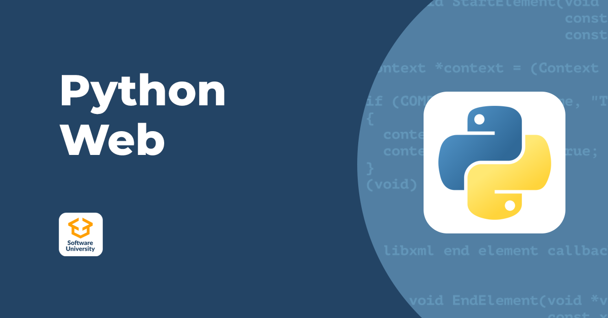

# CantinaShop

## Въведение

**CantinaShop** е онлайн магазин, създаден като финален проект за Python Web 2025 от SoftUni. Магазинът предлага разнообразие от аксесоари, като се стреми да предостави лесен и удобен начин за пазаруване на потребителите.

Проектът демонстрира използването на модерни уеб технологии и добри практики при разработката на уеб приложения с Python, включително:

- Разработка със **sockets** за реално време  
- Стилизиране с помощта на **Tailwind CSS**  
- Хибридна архитектура **REST/MVC**  
- Използване на **Django Template Language (DTL)** за динамично и ефективно рендериране на HTML страници  
- **Асинхронно програмиране** за подобрена производителност и обработка на множество заявки едновременно  
- Написани **автоматизирани тестове** за осигуряване на качество и стабилност  
- Проектът е успешно **деплойнат** и достъпен в продукционна среда

Включени са функционалности за управление на продукти, количка за пазаруване и потребителска регистрация, което прави приложението пълноценно и практично за употреба.

---

## Важно

Този проект **не може да бъде пуснат директно след клониране**, тъй като използва конфигурации за външни API услуги, като например **Cloudinary** за съхранение и обработка на изображения. За да стартирате локално, трябва да конфигурирате необходимите променливи на средата и да осигурите валидни API ключове.

### Необходими конфигурации (пример):

- `SECRET_KEY` — секретен ключ за Django  
- `CLOUDINARY_CLOUD_NAME`  
- `CLOUDINARY_API_KEY`  
- `CLOUDINARY_API_SECRET`,
- Конфигурациите за Email Service Provider и PostgreSQL

Тези променливи се зареждат от `.env` файл или от системната среда с помощта на библиотеката `python-dotenv`.

### Онлайн демонстрация

Може да разгледате проекта на живо: Тук ще бъде линкът към проекта

---

